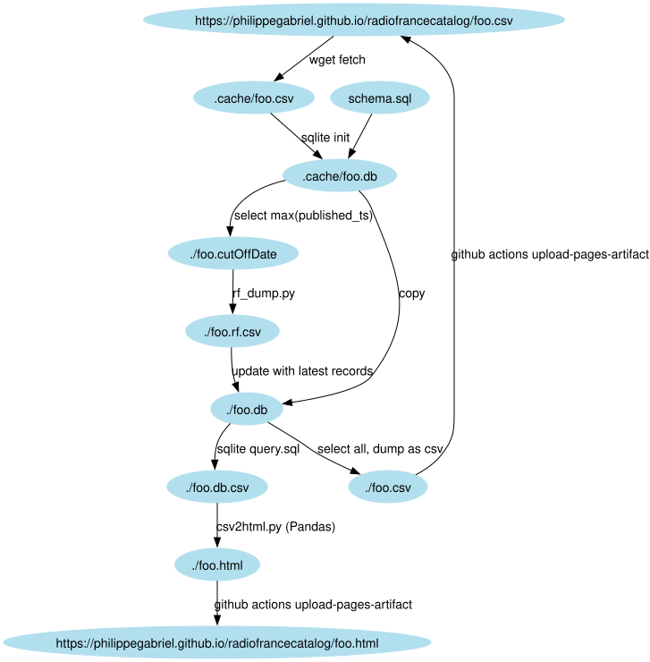

# Fetch metadata from Radio France podcasts
* API: [Radio France's Open API](https://developers.radiofrance.fr/doc/en)
## Retrieve all metadata from:
* https://www.radiofrance.fr/franceinter/podcasts/affaires-sensibles
* https://www.radiofrance.fr/franceculture/podcasts/lsd-la-serie-documentaire
* https://www.radiofrance.fr/franceculture/podcasts/les-nuits-de-france-culture
* https://www.radiofrance.fr/franceculture/podcasts/les-pieds-sur-terre
* https://www.radiofrance.fr/franceculture/podcasts/le-cours-de-l-histoire
* https://www.radiofrance.fr/franceculture/podcasts/mecaniques-du-journalisme
## Worflow

The [compact PostgreSQL schema and JSON/CSV rebuild guide](docs/compact-schema.md)
describes integer episode identities, reconstructed chunk text and half-precision
embeddings. This schema targets a fresh database, leaving existing databases intact.

An episode-partitioned [Dagster pilot](docs/dagster.md) orchestrates existing
transcripts, chunks, embeddings and PostgreSQL imports without relying on file timestamps.
